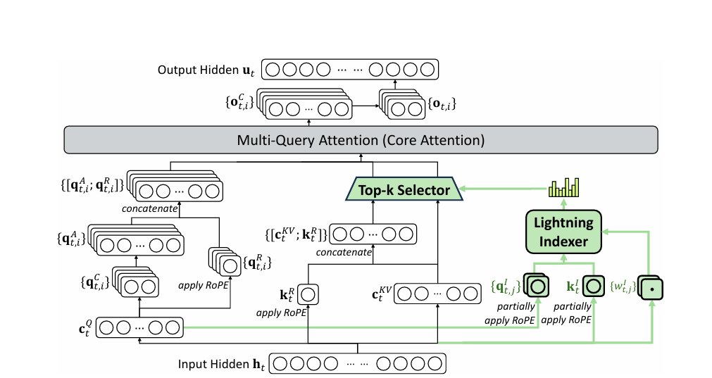
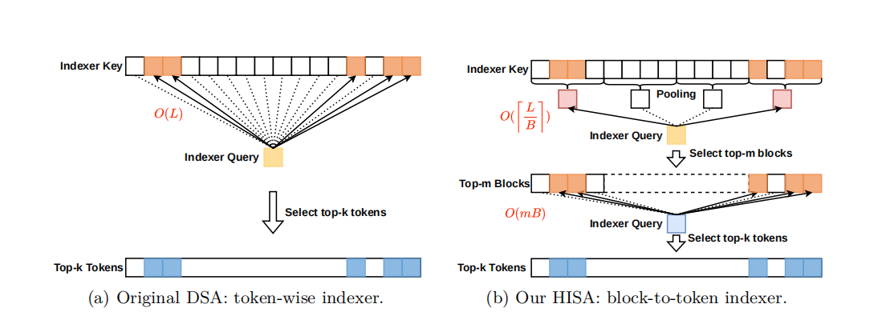
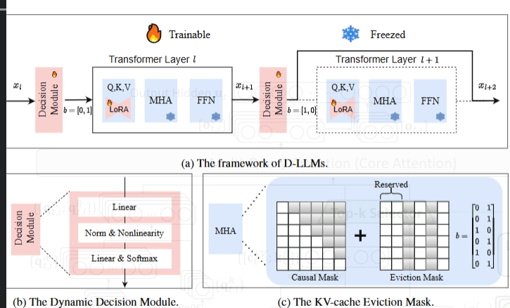

# 论文想法：建立自己的toolbox

## 建立你的“Toolbox” (内化与连接)
这是最关键的一步，让你从“读者”变为“思考者”。你之前问过“toolbox是什么”，现在我们来构建它。

**维护一个“思想库”**：使用Notion, Obsidian或Zotero。每读一篇有价值的论文，就创建一个卡片，包含：

**元信息**：标题，作者，会议/年份。

**一句话核心思想**：作者最想传达的insight是什么？（例如：vLLM的核心思想是 “通过PagedAttention解决KV Cache的内存碎片化问题”）

**问题与方法**：它解决了什么问题？用什么方法解决的？关键结果：最有力的1-2个数字（例如：vLLM将吞吐量提升了20倍）。

**局限与未来工作**：它没解决什么？这往往是你的机会。与你方向的相关性：它和你的“根据地”如何连接？进行“思想杂交”：定期回顾你的“思想库”，玩一个“如果...会怎样”的游戏。如果我把A论文的量化方法应用到B论文的稀疏模型上，会发生什么？如果我用C论文的系统调度思想来优化D论文的推测解码，效果会如何？这就是你找到“切入点”的源泉。

## 最近看到的几个有意思的点：

- **latent space的理解**：潜空间是模型内部的抽象表示空间，维度极低但包含了描述事物本质的核心特征编码。它是模型“思考”的场所，而显式空间是“表达”的界面。如下面的MLA，可以大大压缩维度，提升效率。
> 
- **分块处理**：将大模型的计算分成更小的块，利用局部性原理来优化内存和计算效率。最近指向的论文，如HISA，提出了基于分块的稀疏注意力，显著提升了大模型的推理效率。
> 
- **router的设计**：开始是在MoE（Mixture of Experts）中看到router的概念，D-LLM中也有类似的设计。router的核心作用是根据输入动态选择不同的专家或计算路径，这种动态调度机制可以显著提升模型的效率和适应性。也引出我接下来要讲的自适应性或动态性
> 
- **自适应性/动态性**：模型根据输入的不同，动态调整计算路径或资源分配。这种思想在很多前沿工作中都有体现，如D-LLM中的动态专家选择，vLLM中的动态内存管理，以及HISA中的动态分块处理。这种自适应机制是提升大模型效率的关键。

## 关于最近的论文阅读：
- 有reading就要有writing。要在输入的同时也输出。要开始构思一些自己的想法了。不要等到“有了想法”才写东西，写东西的过程本身就是思考的过程。